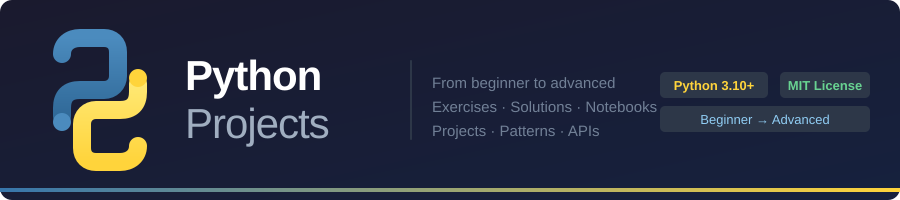
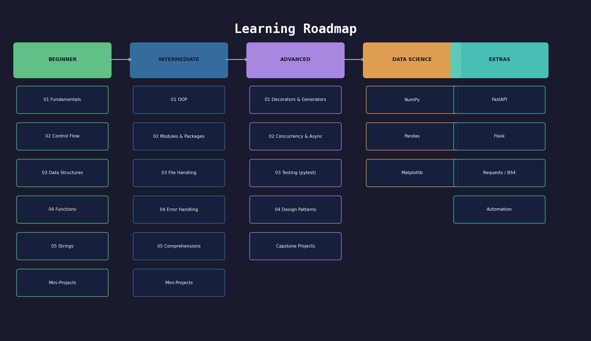

# Python Projects

<p align="center">
  
</p>

<p align="center">
  
  
  
  
</p>

A structured learning repository covering Python from beginner to advanced level — with exercises, solutions, mini-projects, and Jupyter Notebooks for every concept.

---

## Table of Contents

- [About](#about)
- [Repository Structure](#repository-structure)
- [Roadmap](#roadmap)
- [How to Use](#how-to-use)
- [Dependencies](#dependencies)
- [Contributing](#contributing)
- [License](#license)

---

## About

This repository is a curated collection of Python concepts, exercises, and projects organized by difficulty level. Whether you are just starting or looking to sharpen your advanced skills, you will find practical, well-documented content here.

Each topic follows a consistent structure:
- A **README** with explanation and examples
- A **Jupyter Notebook** for interactive learning
- **Exercises** — easy → medium → challenge
- **Solutions** with detailed explanations

---

## Repository Structure

```
python_projects/
│
├── beginner/
│   ├── 01-fundamentals/          # Variables, types, operators
│   ├── 02-control-flow/          # if/elif/else, while, for, break/continue
│   ├── 03-data-structures/       # Lists, dicts, tuples, sets
│   ├── 04-functions/             # def, args, kwargs, lambda, scope
│   ├── 05-string-manipulation/   # Formatting, methods, regex basics
│   └── mini-projects/
│       ├── 01-number-guessing-game/
│       ├── 02-contact-book/
│       └── 03-text-analyzer/
│
├── intermediate/
│   ├── 01-oop/                   # Classes, inheritance, dunder methods
│   ├── 02-modules-packages/      # import, __init__.py, stdlib tour
│   ├── 03-file-handling/         # open, pathlib, CSV, JSON
│   ├── 04-error-handling/        # try/except, custom exceptions, context managers
│   ├── 05-comprehensions/        # List, dict, set, generator expressions
│   └── mini-projects/
│       ├── 01-grade-manager/
│       ├── 02-finance-tracker/
│       └── 03-file-organizer/
│
├── advanced/
│   ├── 01-decorators-generators/ # functools.wraps, args, class-based, yield, send
│   ├── 02-concurrency-async/     # threading, asyncio, multiprocessing
│   ├── 03-testing/               # pytest, fixtures, parametrize, Mock, coverage
│   ├── 04-design-patterns/       # Singleton, Factory, Observer, Strategy, Command…
│   └── projects/
│       ├── 01-task-queue/        # threading + PriorityQueue + Observer
│       ├── 02-test-suite/        # Full pytest suite for a Bank system
│       └── 03-pattern-library/   # Builder + Observer + generator pipeline
│
├── data-science/
│   ├── 01-numpy/                 # Arrays, broadcasting, linear algebra
│   ├── 02-pandas/                # DataFrame, groupby, merge, time series
│   └── 03-matplotlib/            # Line, bar, scatter, subplots, heatmap
│
├── web-development/
│   ├── 01-fastapi/               # REST API, Pydantic, deps, async, routers
│   └── 02-flask/                 # Routes, blueprints, middleware, app factory
│
├── automation/
│   ├── 01-requests-beautifulsoup/ # HTTP requests, scraping, pagination
│   └── 02-automation/             # pathlib, shutil, subprocess, logging, schedule
│
├── assets/                       # Images, diagrams (to be populated)
├── docs/                         # Extended documentation (to be populated)
├── exercises/                    # Standalone cross-topic exercise sets (to be populated)
│   ├── beginner/
│   ├── intermediate/
│   └── advanced/
├── notebooks/                    # Standalone thematic notebooks (to be populated)
└── solutions/                    # Standalone cross-topic solutions (to be populated)
```

---

## Roadmap

<p align="center">
  
</p>

### Beginner
- [x] 01 - Fundamentals (variables, types, operators)
- [x] 02 - Control Flow (if/else, loops)
- [x] 03 - Data Structures (lists, dicts, tuples, sets)
- [x] 04 - Functions
- [x] 05 - String Manipulation
- [x] Mini-Projects (Number Guessing Game, Contact Book, Text Analyzer)

### Intermediate
- [x] 01 - Object-Oriented Programming (OOP)
- [x] 02 - Modules & Packages
- [x] 03 - File Handling
- [x] 04 - Error Handling & Exceptions
- [x] 05 - List/Dict/Set Comprehensions
- [x] Mini-Projects (Grade Manager, Finance Tracker, File Organizer)

### Advanced
- [x] 01 - Decorators & Generators
- [x] 02 - Concurrency & Async
- [x] 03 - Testing (pytest)
- [x] 04 - Design Patterns
- [x] Capstone Projects (Task Queue, Test Suite, Pattern Library)

### Extras
- [x] Data Science (NumPy, Pandas, Matplotlib)
- [x] Web Development (FastAPI, Flask)
- [x] Automation & Scraping (Requests, BeautifulSoup, pathlib, schedule)

### Backlog (not yet started)
- [ ] `assets/` — diagrams and visual aids for each module
- [ ] `docs/` — extended write-ups, cheat sheets, interview prep
- [ ] `exercises/` — cross-topic standalone exercise sets
- [ ] `notebooks/` — thematic standalone notebooks (e.g. algorithms, interview problems)
- [ ] `solutions/` — cross-topic standalone solutions

---

## How to Use

1. **Clone the repository**
   ```bash
   git clone git@github.com:GScandelari/python_projects.git
   cd python_projects
   ```

2. **Create a virtual environment** (recommended)
   ```bash
   python -m venv .venv
   source .venv/bin/activate      # Linux/macOS
   .venv\Scripts\activate         # Windows
   ```

3. **Install dependencies**
   ```bash
   pip install -r requirements.txt
   ```

4. **Navigate to any topic folder** and follow the local README.

5. **Try the exercises** before looking at the solutions.

---

## Dependencies

| Section | Packages |
|---|---|
| Core | Python 3.10+ |
| Notebooks | `jupyter` |
| Testing | `pytest pytest-cov pytest-asyncio` |
| Data Science | `numpy pandas matplotlib` |
| Web Development | `fastapi uvicorn[standard] flask` |
| Automation | `requests beautifulsoup4 lxml schedule watchdog` |

Install everything at once:
```bash
pip install jupyter pytest pytest-cov pytest-asyncio \
            numpy pandas matplotlib \
            fastapi uvicorn[standard] flask \
            requests beautifulsoup4 lxml schedule watchdog
```

---

## Contributing

Contributions are welcome! Please read [CONTRIBUTING.md](CONTRIBUTING.md) before opening a pull request.

1. Fork the project
2. Create your branch: `git checkout -b feature/your-topic`
3. Commit your changes: `git commit -m "Add: your-topic module"`
4. Push to the branch: `git push origin feature/your-topic`
5. Open a Pull Request

---

## License

This project is licensed under the MIT License. See [LICENSE](LICENSE) for details.

---

> Built with focus and consistency. One concept at a time.
